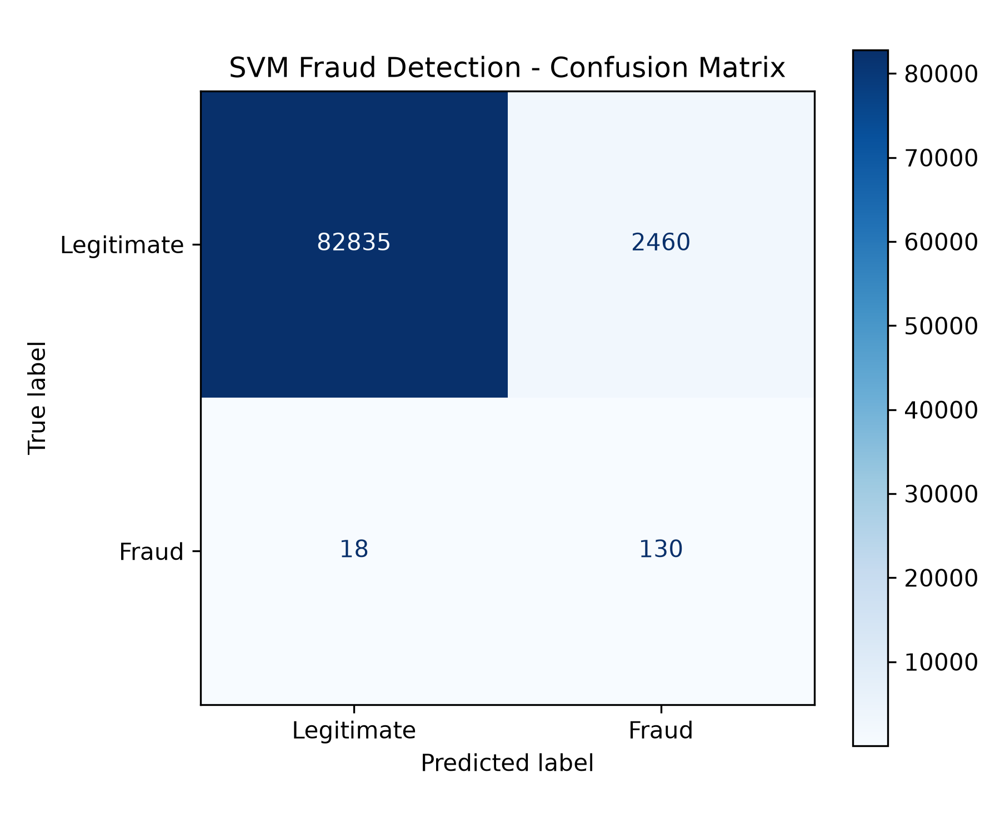

# 💳 Credit Card Fraud Detection Pipeline

An end-to-end, modular machine learning pipeline built in Python to detect fraudulent credit card transactions. 

This project takes a raw dataset of **284,807 European cardholder transactions** and applies class-weight balancing, feature normalization ($L_1$ norm), and Scikit-Learn models to identify fraud with high recall and precision.

---

## 🎯 Key Business Results

* **High Fraud Detection Rate:** Successfully identified **87.8% (130 out of 148)** fraudulent transactions in the test dataset.
* **Fast Processing Speed:** Model training and evaluation complete in under **2 seconds**.
* **Model Benchmark (SVM):** Achieved an **ROC-AUC score of 0.9740**.

---

## 📊 Model Evaluation & Confusion Matrix

Because financial fraud represents less than **0.2%** of all transactions, standard accuracy is misleading. The model was evaluated using Precision, Recall and Hinge Loss metrics to prioritize catching fraudulent events without generating excessive false alarms.

---

## 📁 Pipeline Architecture

The project is structured into 5 independent, modular Python scripts following software engineering best practices:

* `01_download_data.py`: Downloads and extracts the dataset (`creditcard.csv`).
* `02_data_preprocessing.py`: Scales transaction amounts, normalizes features, handles class imbalance and splits data (70/30).
* `03_train_decision_tree.py`: Trains a Decision Tree Classifier and evaluates baseline ROC-AUC.
* `04_train_svm.py`: Trains a Support Vector Machine (`LinearSVC`) with balanced class weights.
* `05_evaluate_and_plot.py`: Computes classification reports and exports visual evaluation metrics (`confusion_matrix.png`).

---
